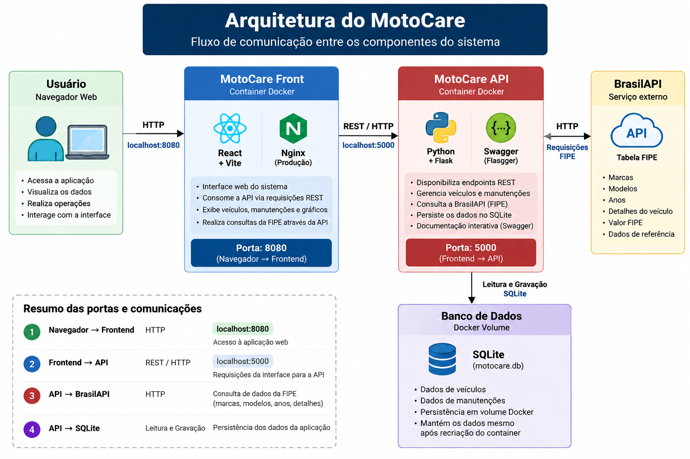

# MotoCare API

API REST desenvolvida para o projeto **MotoCare**, um sistema web para gerenciamento de veículos e suas manutenções.

A API é responsável pelo gerenciamento e persistência dos dados da aplicação, disponibilizando operações de cadastro, consulta, atualização e exclusão de veículos e manutenções.

O projeto também realiza integração com a **BrasilAPI**, utilizando os serviços da tabela FIPE para consulta de marcas, modelos, anos e informações de veículos.

---

## Tecnologias utilizadas

- Python
- Flask
- SQLite
- Flask-CORS
- Flasgger / Swagger
- Requests
- Docker
- BrasilAPI / FIPE

---

## Funcionalidades

A API disponibiliza:

- Cadastro de veículos
- Consulta de veículos
- Atualização de veículos
- Exclusão de veículos
- Cadastro de manutenções
- Consulta de manutenções
- Atualização de manutenções
- Exclusão de manutenções
- Consulta de marcas pela FIPE
- Consulta de modelos pela FIPE
- Consulta de anos pela FIPE
- Consulta de detalhes e valor FIPE
- Documentação interativa utilizando Swagger
- Persistência de dados utilizando SQLite

---

## Estrutura do projeto

```text
motocare-api/
│
├── database/
│   └── motocare.db
│
├── routes/
│   ├── __init__.py
│   ├── fipe.py
│   ├── manutencoes.py
│   └── veiculos.py
│
├── .dockerignore
├── .gitignore
├── app.py
├── database.py
├── Dockerfile
├── README.md
└── requirements.txt
```

---

## Banco de dados

O projeto utiliza **SQLite** para persistência dos dados.

São utilizadas duas entidades principais:

### Veículos

Armazena informações como:

- tipo
- marca
- modelo
- ano
- placa
- quilometragem

### Manutenções

Armazena informações como:

- veículo
- tipo da manutenção
- data
- quilometragem
- valor
- próxima quilometragem
- observações

As manutenções são relacionadas aos veículos cadastrados.

---

## Executando localmente

### 1. Clone o repositório

git clone https://github.com/MateusAtaide/motocare-api.git

Entre na pasta:

```bash
cd motocare-api
```

### 2. Crie um ambiente virtual

No Windows:

```bash
python -m venv .venv
```

Ative o ambiente:

```bash
.venv\Scripts\activate
```

### 3. Instale as dependências

```bash
pip install -r requirements.txt
```

### 4. Execute a aplicação

```bash
python app.py
```

A API estará disponível em:

```text
http://127.0.0.1:5000
```

---

## Swagger

A documentação interativa da API está disponível através do Swagger.

Com a aplicação em execução, acesse:

```text
http://127.0.0.1:5000/apidocs/
```

Através do Swagger é possível visualizar e testar as rotas disponíveis.

---

## Principais endpoints

### Veículos

| Método | Endpoint | Descrição |
|---|---|---|
| GET | `/veiculos` | Lista os veículos |
| GET | `/veiculos/{id}` | Consulta um veículo |
| POST | `/veiculos` | Cadastra um veículo |
| PUT | `/veiculos/{id}` | Atualiza um veículo |
| DELETE | `/veiculos/{id}` | Exclui um veículo |

### Manutenções

| Método | Endpoint | Descrição |
|---|---|---|
| GET | `/manutencoes` | Lista as manutenções |
| GET | `/manutencoes/{id}` | Consulta uma manutenção |
| POST | `/manutencoes` | Cadastra uma manutenção |
| PUT | `/manutencoes/{id}` | Atualiza uma manutenção |
| DELETE | `/manutencoes/{id}` | Exclui uma manutenção |

### FIPE

| Método | Endpoint | Descrição |
|---|---|---|
| GET | `/fipe/marcas/{tipo}` | Consulta marcas |
| GET | `/fipe/modelos/{tipo}/{marca}` | Consulta modelos |
| GET | `/fipe/anos/{tipo}/{marca}/{modelo}` | Consulta anos |
| GET | `/fipe/detalhes/{tipo}/{marca}/{modelo}/{ano}` | Consulta detalhes FIPE |

---

## Integração com API externa - BrasilAPI / FIPE

O MotoCare utiliza a **BrasilAPI** como componente externo para obtenção de
informações da tabela FIPE.

A BrasilAPI é um projeto que disponibiliza dados públicos brasileiros através
de uma API HTTP. No MotoCare são utilizados os endpoints relacionados à
tabela FIPE para consultar marcas, modelos, anos e detalhes de veículos.

### Informações da API externa

- **API:** BrasilAPI
- **Serviço utilizado:** FIPE
- **Documentação:** https://brasilapi.com.br/docs
- **Site oficial:** https://brasilapi.com.br/
- **Licença:** MIT
- **Autenticação/registro:** não utilizado pelo MotoCare

### Endpoints externos utilizados

O backend do MotoCare utiliza as seguintes operações da BrasilAPI:

| Operação | Endpoint BrasilAPI |
|---|---|
| Consultar marcas | `GET /api/fipe/marcas/v1/{vehicleType}` |
| Consultar modelos | `GET /api/fipe/veiculos/v1/{vehicleType}/{makerCode}` |
| Consultar anos | `GET /api/fipe/anos/v1/{vehicleType}/{makerCode}/{modelCode}` |
| Consultar detalhes | `GET /api/fipe/detalhes/v1/{vehicleType}/{makerCode}/{modelCode}/{yearCode}` |

Os tipos de veículos suportados pela BrasilAPI para essas consultas são:

- `carros`
- `motos`
- `caminhoes`

### Fluxo da integração

O frontend não acessa diretamente a BrasilAPI.

A integração é realizada através da API Flask do MotoCare:

```text
MotoCare Front
      |
      | REST
      v
MotoCare API
      |
      | HTTP
      v
BrasilAPI / FIPE

---

## Docker

O projeto possui um `Dockerfile` para execução da API em container.

### Criar a imagem

Na raiz do projeto:

```bash
docker build -t motocare-api .
```

### Executar o container

```bash
docker run --name motocare-api-container -p 5000:5000 -v motocare-data:/app/database motocare-api
```

A API estará disponível em:

```text
http://127.0.0.1:5000
```

E o Swagger em:

```text
http://127.0.0.1:5000/apidocs/
```

---

## Persistência com Docker

Para impedir a perda do banco SQLite quando o container for removido, é utilizado um volume Docker:

```text
motocare-data
```

O volume é montado em:

```text
/app/database
```

Exemplo:

```bash
docker run --name motocare-api-container -p 5000:5000 -v motocare-data:/app/database motocare-api
```

Dessa maneira, os dados permanecem armazenados mesmo que o container da API seja removido e criado novamente.

Para visualizar os volumes:

```bash
docker volume ls
```

---

## Arquitetura




O frontend é responsável pela interface com o usuário.

A API Flask implementa as regras da aplicação, realiza a persistência no SQLite e fornece os endpoints REST.

A BrasilAPI funciona como componente externo utilizado para consulta das informações da tabela FIPE.

---

## Repositório do frontend

O frontend do MotoCare é mantido em um repositório separado:

https://github.com/MateusAtaide/motocare-front.git

---

## Autor

Desenvolvido por **Mateus Ataide da Silva**.